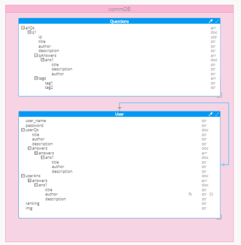
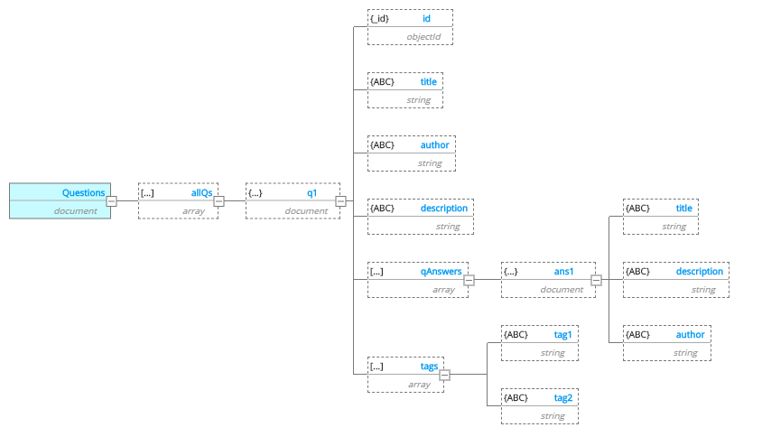
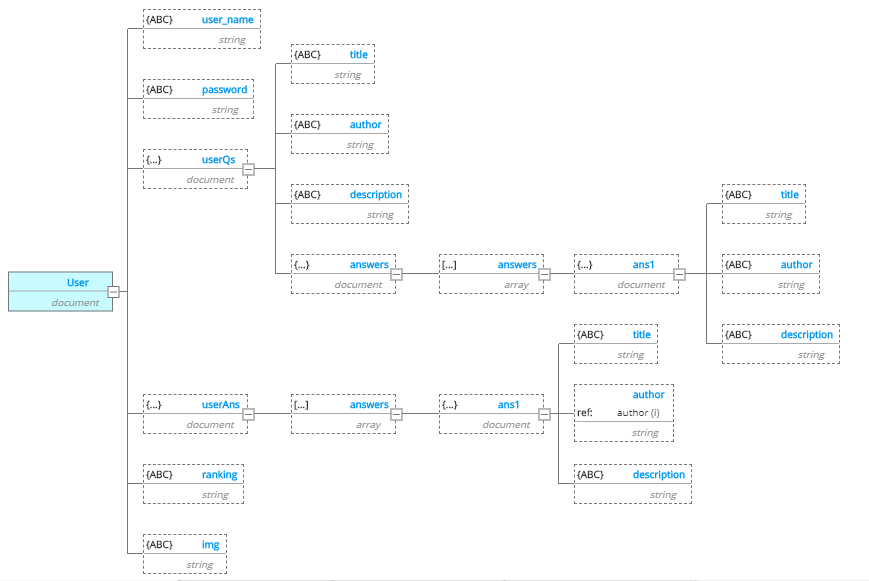

# synhub

- Project Name: SunHub

- Team Members:

    1. Darah Shalabi
    2. Yousef AlShun
    3. Muhammed Tommalieh
    4. Batool Al-Ali

- A description of the project This application will help users to connect with developer to help each other in coding.

- The overall problem domain and how the project solves those problems is need of finding help while we are coding, to debug problems and find answers to our questions, so this website will help developer to communicate easily.

- Semantic versioning, beginning with version 1.0.0 and incremented as changes are made v1.0.1 readme updates

- User Stories

Given that a user opens the application in their browser When they will be displayed with the applications homepage Then the website will allow them to know more and navigate through the pages with easy accessability

- As a user, I want to find answer so that I can access previous answers.
- As a user, I want to ask a question so that I can  previous answers.
- As a user, I want to ask a question so that I can post a new question.
- As a user, I want to have the opportunity to answer questions.
- As a user, I want to have the opportunity to chat with other users.

- DB Relationship Diagram

